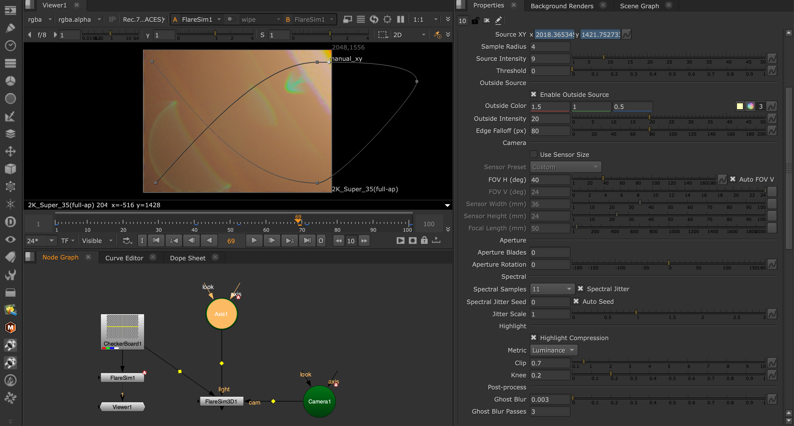

# FlareSim for Nuke

A physically-based lens flare simulator for Foundry Nuke — GPU-optimised fork of [LocalStarlight/flaresim_nuke](https://github.com/LocalStarlight/flaresim_nuke).



I really appreciate Steven (LocalStarlight) for open-sourcing FlareSim. This is my version from the eyes of a compositor — built to be fast and flexible enough to handle everything a client might ask for.

The original FlareSim is a Windows/Nuke 16 plugin built on CUDA 13. This fork adds **Linux** and **macOS** support, works with **Nuke 14–17**, and brings major GPU performance improvements — async CUDA streams, FP16 output, prefix-sum blur kernels, and a per-surface art-direction UI. The core optics (ray tracing, Fresnel, lens files) are unchanged; all the work is in the GPU pipeline, the Nuke integration, and the build system.

---

## What's New

### FlareSim3D — Camera + Axis driven flares

A new node that takes a **Camera** and an **Axis** (light position) as inputs instead of a manual Source XY. The Axis world position is projected through the Camera to derive screen position and source distance automatically — no manual XY tracking needed. Connect a Camera and an Axis, and the flare tracks the 3D source through the shot.

- **Intensity Falloff** — inverse-square-law scaling based on source distance
- **Reference Distance** — distance (scene units) at which the flare has its nominal intensity
- Source behind camera → no flare (physically correct)
- Source off-screen → transitions seamlessly to Outside Source

Registered as `Filter/FlareSim3D`. Builds as a separate `.so` / `.dylib`.

### Off-Screen Source

When the light source moves outside the frame, the flare no longer vanishes. A user-defined colour and intensity takes over, so the flare renders seamlessly as the source enters or leaves the plate. Works in both FlareSim (manual XY) and FlareSim3D (Camera + Axis).

- **Enable Outside Source** — on/off toggle
- **Outside Color** — RGB colour of the off-screen light
- **Outside Intensity** — brightness of the off-screen source
- **Edge Falloff (px)** — blend zone at the frame edge for smooth transitions

### Spectral Jitter

Randomises each ray's wavelength within its spectral bin, smoothing the hard colour boundaries between discrete samples at zero extra ray-trace cost — same number of traces, each one uses a slightly different wavelength.

- **Spectral Jitter** — on/off (on by default)
- **Spectral Jitter Seed** — fixed seed for VFX reproducibility
- **Auto Seed** — derives seed from frame number for temporal variation
- **Jitter Scale** — multiplier on the randomisation range (0.5 = subtle, 1.0 = default, 2.0 = aggressive)

### Extended Spectral Samples

The spectral samples dropdown now goes up to 31: **3 (R/G/B)** · 5 · 7 · 9 · 11 · 15 · 21 · 31. With spectral jitter on, 11 samples already looks excellent. 31 gives ~10 nm bin spacing — essentially continuous spectral coverage.

### Highlight Compression

Luminance-preserving soft-clip applied on the GPU after blur. Prevents hard-clipped highlights and super-white values while maintaining colour hue through the rolloff.

- **Highlight Compression** — on/off toggle
- **Metric** — Value (max RGB), Luminance (Rec.709), or Lightness (cube root)
- **Clip** — maximum output value (asymptotic ceiling, default 2.0)
- **Knee** — transition sharpness (0 = very soft, 1 = hard clip, default 0.5)

Matches AFXToneMap convention — same Clip and Knee values produce almost the same rolloff behaviour.

### Per-Surface Art Direction

Each lens surface now has individual controls in the Surfaces tab: **gain**, **color** (RGB tint), **offset** (pixel shift x/y), and **scale** (pull toward / push away from centre). Both surfaces in a ghost pair combine together.

### Profiler

Built-in per-frame timing table. Disabled by default — flip `#define FLARESIM_PROFILE 1` in the source to enable.

---

## Performance: 205× faster

Same lens (Angenieux 180mm, 15 surfaces, 66 active pairs), same frame, same machine (RTX A5000). Buffer: 10172×5370, ghost blur radius 35 px, 2 passes.

| Stage | Original | Fork | Speedup |
|-------|----------|------|---------|
| Source detection | 3,238 ms | 8 ms | **425×** |
| Ghost filter | 8 ms | 8 ms | — |
| CUDA ghost kernel | 6,398 ms | 31 ms | **206×** |
| Ghost blur + readback | 9,359 ms | 56 ms | **167×** |
| **TOTAL** | **21,091 ms** | **103 ms** | **205×** |

21 seconds → 0.1 seconds. Interactive.

---

## Platforms

| Platform | GPU Backend | Status |
|---|---|---|
| **Linux** | CUDA | Fully supported — pre-built binaries and build-from-source |
| **macOS** | Metal | Supported — build-from-source |
| **Windows** | CUDA | Supported — build-from-source (Ninja + MSVC 2022) |

---

## Building from Source

### Linux

```bash
export PATH=/usr/local/cuda-12.1/bin:$PATH
export LD_LIBRARY_PATH=/usr/local/cuda-12.1/lib64:$LD_LIBRARY_PATH

rm -rf build && mkdir build && cd build

cmake .. -DNUKE_VERSION=14.1v8 \
         -DCMAKE_CUDA_ARCHITECTURES="86;89;90"

make -j$(nproc)
```

Output: `build/FlareSim.so` + `build/FlareSim3D.so`

Adjust `NUKE_VERSION` and `CMAKE_CUDA_ARCHITECTURES` to match your environment. `NDK_ROOT` and `NUKE_LIB_DIR` default to `/usr/local/Nuke<VERSION>`. CUDA runtime is linked statically — no runtime dependency.

### macOS (Metal)

```bash
rm -rf build && mkdir build && cd build

cmake .. -DNUKE_VERSION=14.1v8

make -j$(sysctl -n hw.ncpu)
```

Output: `build/FlareSim.dylib` + `build/FlareSim3D.dylib`

Metal shaders are compiled at plugin load time. No CUDA required.

### Windows

Requires Visual Studio 2022 Developer Command Prompt and CUDA 12.4 (or any 12.x). Uses Ninja generator — the VS generator ignores `CMAKE_CUDA_COMPILER`.

```cmd
set PATH=C:\Program Files\NVIDIA GPU Computing Toolkit\CUDA\v12.4\bin;%PATH%

cd C:\path\to\flaresim_nuke

rmdir /s /q build 2>nul & mkdir build && cd build && cmake .. -G Ninja -DCMAKE_BUILD_TYPE=Release -DCMAKE_CXX_COMPILER=cl -DCMAKE_CUDA_COMPILER="C:/Program Files/NVIDIA GPU Computing Toolkit/CUDA/v12.4/bin/nvcc.exe" -DNUKE_VERSION=14.1v8 -DCMAKE_CUDA_ARCHITECTURES="86;89;90" && cmake --build .
```

Output: `build\FlareSim.dll` + `build\FlareSim3D.dll`

CUDA runtime is linked statically — no `cudart64_*.dll` needed at runtime. The plugin only requires an NVIDIA driver ≥ 525 (CUDA 12.4 minimum). Any newer driver (12.8, 12.9, 13.x) works — drivers are forward-compatible.

### CUDA Architecture Reference

| Architecture | GPUs | Min CUDA |
|---|---|---|
| sm_70 | V100, Titan V | 9.0 |
| sm_75 | RTX 2000, T4 | 10.0 |
| sm_86 | RTX 3000, A5000/A6000 | 11.1 |
| sm_89 | RTX 4000 | 11.8 |
| sm_90 | H100 | 12.0 |
| sm_100 | RTX 5000, B200 | 12.8 |

Default: `86;89;90` (covers Ampere through Hopper). Add `100` for Blackwell if your CUDA toolkit supports it.

---

## Installation

1. Copy `FlareSim.so` (or `.dylib` / `.dll`) and `FlareSim3D.so` to a directory on your `NUKE_PATH`, for example `~/.nuke/plugins/`.
2. Add to your `menu.py`:
   ```python
   nuke.menu('Nodes').addCommand('Filter/FlareSim', 'nuke.createNode("FlareSim")')
   nuke.menu('Nodes').addCommand('Filter/FlareSim3D', 'nuke.createNode("FlareSim3D")')
   ```
3. Copy the `lenses/` folder somewhere accessible and point the **Lens File** knob at a `.lens` file.
4. Restart Nuke.

---

## Quick Start

**FlareSim** (manual source):
1. Connect your plate to the input.
2. Point **Lens File** at a `.lens` prescription.
3. Set **FOV H** to match your camera.
4. Set **Source XY** to the light source position, or raise **Threshold** to auto-detect bright highlights.
5. Adjust **Flare Gain** to taste.

**FlareSim3D** (3D source):
1. Connect your plate to input 0, Camera to input 1, Axis (at the light position) to input 2.
2. Point **Lens File** at a `.lens` prescription.
3. The flare tracks the Axis through the Camera automatically.
4. Enable **Intensity Falloff** and set **Reference Distance** for distance-based dimming.
5. Enable **Outside Source** so the flare persists when the source leaves the frame.

---

---

## Anamorphic Support

Anamorphic lenses produce ghosts and flares with a different shape than spherical lenses — horizontal streaks, oval bokeh, asymmetric, rainbow chromatic aberrations. These signatures arise from cylindrical and toric refractive surfaces inside the actual lens, not from a post-render warp. FlareSim now traces rays through real anamorphic geometry on both CPU and GPU.

### What's supported

- **Cylindrical surfaces** — `cyl_x` (axis along X) and `cyl_y` (axis along Y). Used by every common anamorphic afocal attachment design (CinemaScope, Panavision C-series, Cooke Anamorphic/i, Hawk, Iscorama-style adapters)
- **Toric surfaces** — two-radii curvature in orthogonal axes. Solved on GPU via Newton-Raphson on the implicit quartic. Used by some modern anamorphic designs that prefer single-element correctors over Galilean afocal blocks
- **Mixed geometry** — a single `.lens` file can freely combine spherical, cylindrical, and toric surfaces in any order
- **All ghost reflections respect surface curvature type** — a `cyl_y` reflection produces a horizontal streak; a toric reflection produces an asymmetric defocus pattern; both happen automatically based on what the `.lens` file declares
- **FlareSim and FlareSim3D both anamorphic-ready** — they share the same lens / trace / ghost code paths, no per-node anamorphic plumbing

### What you'll see in render

- Horizontal anamorphic streak from `cyl_y` reflections — the iconic streak
- Oval bokeh that comes naturally from a squeezed entrance pupil
- Rainbow color separation when you combine low-Abbe-number glass with uncoated surfaces (the Cooke SF look)
- Different ghost geometry vs the same lens with all spherical surfaces — visibly different on side-by-side renders

### Test lenses included

| File | Purpose |
| --- | --- |
| `lenses/Anamorphic_Test_50mm_2x.lens` | 2× squeeze, all-`cyl_y` afocal block — exercises the cylinder path |
| `lenses/Anamorphic_Test_50mm_2x_toric.lens` | Same lens with one cyl_y promoted to `toric` — exercises the toric Newton solver |

---

## Authoring Anamorphic .lens Files

If you want to build your own anamorphic prescription, here's everything you need to know.

### File format

A line in the `surfaces:` section now accepts up to 8 tokens. Tokens 1–6 are unchanged from the original FlareSim, so every existing `.lens` file still loads bit-identically:

```
radius   thickness   ior    abbe   semi_ap   coating   [type]   [radius_y]
```

Tokens 7 and 8 are optional. Missing → spherical (the legacy default).

| Type token | Meaning | What `radius` means | Needs `radius_y`? |
| --- | --- | --- | --- |
| `sph` (or omitted) | Spherical | R | no |
| `cyl_x` | Cylinder, axis along X — curves in YZ | Ry (vertical-axis curvature) | no |
| `cyl_y` | Cylinder, axis along Y — curves in XZ | Rx (horizontal-axis curvature) | no |
| `toric` | Two orthogonal radii | Rx | yes — supply Ry as the 8th token |

For a horizontal anamorphic squeeze (the standard cinematic look), you almost always want `cyl_y` — the cylinder axis is vertical, so the surface refracts only in the horizontal axis. Vertical rays pass straight through, horizontal rays get squeezed.

### Example — minimal cyl_y front element

```
# Anamorphic 50mm 2x test
name: Test 50mm 2x
focal_length: 50.0

surfaces:
# radius   thickness   ior      abbe   semi_ap   coating   type
  -50.0    8.00        1.5168   64.2   45.0      1         cyl_y    # plano-concave neg cyl
  0        92.00       1.0      0.0    45.0      0                  # flat back, 92 mm air gap
  0        10.00       1.5168   64.2   40.0      1                  # flat front of pos cyl
  -100.0   15.00       1.0      0.0    40.0      0         cyl_y    # plano-convex pos cyl
  ... rest of taking lens (spherical) ...
```

That's a Galilean afocal cylindrical attachment with a 2× horizontal squeeze: |F2|/|F1| = 194/97 = 2.0.

### Designing a squeeze ratio

For an afocal attachment with squeeze ratio S, you need a negative-then-positive cylindrical pair:

- Pick F1 (negative cyl, plano-concave) and F2 (positive cyl, plano-convex) such that |F2|/|F1| = S
- Air gap between them = F1 + F2 (F1 is negative, so gap = F2 − |F1|)
- For a thin plano-cylindrical with refractive index n: F = (n − 1)·R for plano-concave with R<0, or F = −(n − 1)·R for plano-convex with back R<0

Common ratios in the wild:

| Squeeze | Examples |
| --- | --- |
| 1.33× | Iscorama-style adapters, Atlas Mercury, vintage scope add-ons |
| 1.8× | Cooke Anamorphic/i FF, Vantage Hawk Class-X — full-frame friendly |
| 2× | Cooke S35, Panavision, traditional CinemaScope/Hollywood scope |

### Geometric validity gotcha

**The semi-aperture must be smaller than `|R|`** for any spherical or cylindrical curved surface. A surface with R = −30 cannot have semi_aperture = 40 — the sphere physically doesn't extend that far in the radial direction. The trace will silently miss those rays and you'll see almost no ghosts.

Rule of thumb: keep `semi_aperture < |R|` for curved surfaces. Use `semi_aperture < 0.7·|R|` if you want margin for off-axis behavior. (This applies to all curved types — spherical, cylindrical, and toric. Toric must satisfy this for both Rx and Ry.)

### Coating and Abbe number choices for the look you want

Coating layer count maps to ghost brightness via Fresnel reflectance:

| Goal | Coating value | Per-surface reflectance (approx) |
| --- | --- | --- |
| Modern multi-coated lens (clean, dim ghosts) | `2` or higher | <0.5% |
| Vintage single-coated lens (visible flares) | `1` (MgF2 quarter-wave) | ~1% |
| Cooke "Special Flair" / heavy flare style | `0` (uncoated) | ~4% |

Abbe number controls dispersion (rainbow color spread). Lower Abbe → more spectral separation in ghosts:

- Crown glass: `n=1.5168, abbe=64.2` (BK7) — minimal chromatic aberration in ghosts
- Heavy flint: `n=1.6068, abbe=37.0` (SF6) — strong color spread, the basis of the "rainbow flare" look

---

## What Changed

### Anamorphic support (new since the previous version of this fork)

* **Cylindrical surfaces** — CPU intersection in `trace.cpp::intersect_cylinder_x/y`, GPU mirror in `ghost_cuda.cu::d_intersect_cylinder_x/y`
* **Toric surfaces** — Newton-Raphson on the implicit quartic, CPU + GPU. `MAX_ITER` tuned to 16 (down from a conservative 30) based on instrumented convergence data on adversarial test sets
* **Lens parser extensions** — optional 7th and 8th tokens for surface type and Ry. Legacy spherical files load byte-identically

---


## Future Ideas

1. **Starburst as a separate node** — a standalone diffraction spike generator with more controls, decoupled from the ghost renderer.

---

## Credits

FlareSim is built on the foundational work of **Steve Watts Kennedy** ([LocalStarlight](https://github.com/LocalStarlight/flaresim_nuke)), whose original CUDA-based lens flare renderer established the core ray-tracing approach, optical physics, and lens file format.

The original physics engine is based on the work of **Eamonn Nugent** ([@space55](https://github.com/space55) · [55.dev](https://55.dev/)), whose CPU-based renderer ([blackhole-rt](https://github.com/space55/blackhole-rt/)) provided the ray-tracing foundation.

Tutorial by Steve: [https://youtu.be/yEsBOQNG16Y](https://youtu.be/yEsBOQNG16Y)

---

## License

MIT — see [LICENSE](LICENSE).

Peter Mercell — [petermercell.com](https://petermercell.com)
